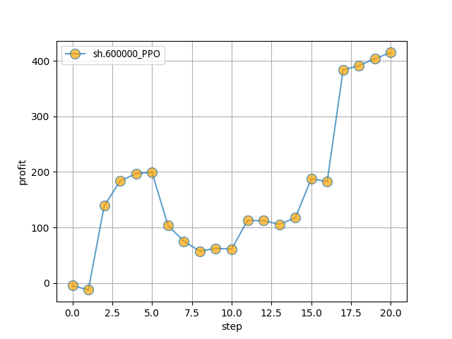
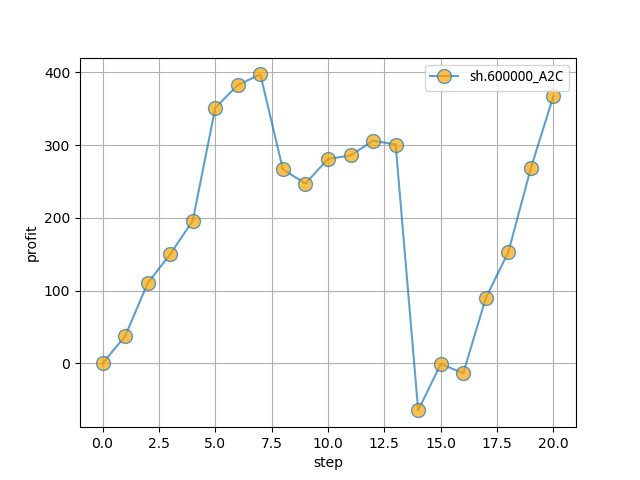

# 强化学习炒股，走向人生巅峰（或倾家荡产）

## 免责声明
- 本网站所载的资料并不构成投资的意见或建议，据此操作风险自担。股市有风险，投资需谨慎！


## Quickstart
#### 1. 数据获取
```
nohup python -u python data/get_stock_data_train.py > get_train.log 2>&1 &
nohup python -u python data/get_stock_data_test.py > get_test.log 2>&1 &
```
#### 2. 设置配置文件config.yaml(也可使用默认配置参数)
#### 3. 运行模型
```
python main.py
```


## 代码参考
本项目的代码参考了以下两个repo,感谢原作者！参考内容包括股票Gym环境、股票数据获取、结果的可视化。
- [RL-Stock](https://github.com/wangshub/RL-Stock)
- [Create custom gym environments from scratch — A stock market example](https://towardsdatascience.com/creating-a-custom-openai-gym-environment-for-stock-trading-be532be3910e)

主要改动:
1. 调整代码结构,增加配置文件
2. RL算法模型使用最新版本的stable-baselines3，之前的stable-baselines已处于维护状态，且容易遇到tensorflow版本不兼容的问题
3. 丰富RL模型
4. 增加交易手续费
5. 股票价格后复权

todo:
- 将特征接口抽出来
- 将模型接口抽出来
- 将reward的定义抽出来
- 特征优化
- 模型优化

## 股票数据
- 数据和方法皆来源于网络，本项目开发者无法保证有效性和准确性！

- 股票证券数据集来自于 [baostock](http://baostock.com/baostock/index.php/Python_API%E6%96%87%E6%A1%A3)，一个免费、开源的证券数据平台，提供 Python API。

- 项目中将1990-01-01至2019-11-29的股票数据作为训练集，之后的一个月(2019-12-01至2019-12-31)数据作为测试集


## 🤖 OpenAI Gym 股票交易环境

### 观测 Observation

策略网络观测的就是一只股票的各项参数，比如开盘价、收盘价、成交数量等。部分数值会是一个很大的数值，比如成交金额或者成交量，有可能百万、千万乃至更大，为了训练时网络收敛，观测的状态数据输入时，必须要进行归一化，变换到 `[-1, 1]` 的区间内。

|参数名称|参数描述|说明|
|---|---|---|
|date|交易所行情日期|格式：YYYY-MM-DD|
|code|证券代码|格式：sh.600000。sh：上海，sz：深圳|
|open|今开盘价格|精度：小数点后4位；单位：人民币元|
|high|最高价|精度：小数点后4位；单位：人民币元|
|low|最低价|精度：小数点后4位；单位：人民币元|
|close|今收盘价|精度：小数点后4位；单位：人民币元|
|preclose|昨日收盘价|精度：小数点后4位；单位：人民币元|
|volume|成交数量|单位：股|
|amount|成交金额|精度：小数点后4位；单位：人民币元|
|adjustflag|复权状态|不复权、前复权、后复权|
|turn|换手率|精度：小数点后6位；单位：%|
|tradestatus|交易状态|1：正常交易 0：停牌|
|pctChg|涨跌幅（百分比）|精度：小数点后6位|
|peTTM|滚动市盈率|精度：小数点后6位|
|psTTM|滚动市销率|精度：小数点后6位|
|pcfNcfTTM|滚动市现率|精度：小数点后6位|
|pbMRQ|市净率|精度：小数点后6位|

### 动作 Action

假设交易共有**买入**、**卖出**和**保持** 3 种操作，定义动作(`action`)为长度为 2 的数组

- `action[0]` 为操作类型；
- `action[1]` 表示买入或卖出百分比；

| 动作类型 `action[0]` | 说明 |
|---|---|
| 1 | 买入 `action[1]`|
| 2 | 卖出 `action[1]`|
| 3 | 保持 |

注意，当动作类型 `action[0] = 3` 时，表示不买也不抛售股票，此时 `action[1]` 的值无实际意义，网络在训练过程中，Agent 会慢慢学习到这一信息。

### 奖励 Reward

奖励函数的设计，对强化学习的目标至关重要。
提供两个reward的设计方案: 

```
# reward 1:
# 利润为正时reward为1; 当利润为负值时，reward为-100
reward = self.net_worth - INITIAL_ACCOUNT_BALANCE
reward = 1 if reward > 0 else -100
```

```
# reward 2:
# 账户余额乘以时间系数(避免早期阶段过快地奖励Agent,使得它进行充分探索；对于长期保持高现金流进行奖励)
# delay_modifier = (self.current_step / MAX_STEPS)
# reward = self.balance * delay_modifier
```

## RL算法
- PPO
- A2C

## 🕵️‍♀️ 单只股票模拟实验结果

- 初始本金 `10000`
- 股票代码：`sh.600000`
- 训练集： `stockdata/train/sh.600000.浦发银行.csv`
- 测试集： `stockdata/test/sh.600000.浦发银行.csv`
- 模拟操作 `20` 天

盈利情况:

PPO: 盈利`415`


A2C: 亏损`534`



## 📚 参考资料
1. [Create custom gym environments from scratch — A stock market example](https://towardsdatascience.com/creating-a-custom-openai-gym-environment-for-stock-trading-be532be3910e)
2. [RL-Stock](https://github.com/wangshub/RL-Stock)
3. Deep-Reinforcement-Learning-Hands-On, chapter 10
