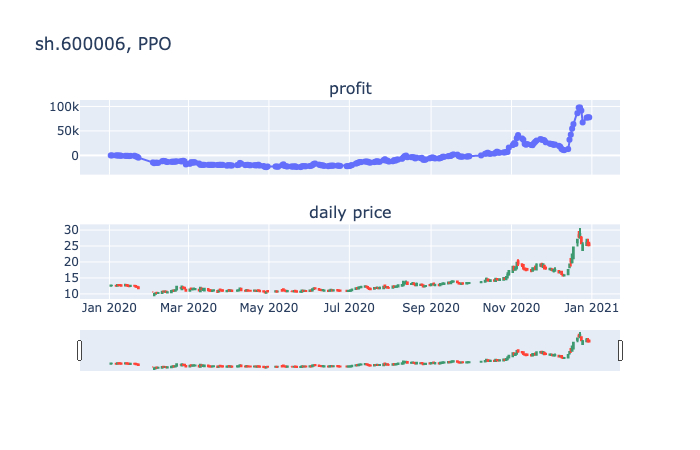
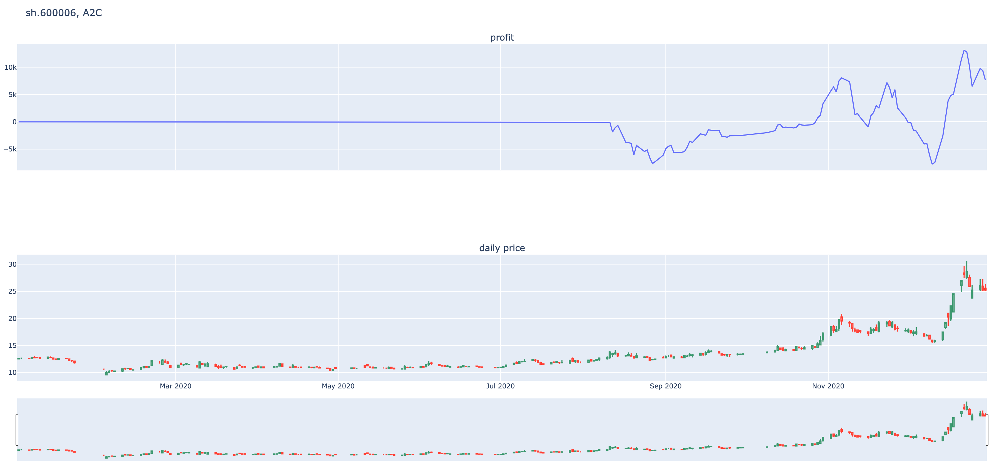

# 强化学习炒股，走向人生巅峰（或倾家荡产）

## 免责声明
- 本网站所载的资料并不构成投资的意见或建议，据此操作风险自担。股市有风险，投资需谨慎！

## Quickstart

### 单股票
#### 1. 数据获取
以下任选一种:
```
cd data
nohup python -u get_stock_data_baostock_train.py > get_train.log 2>&1 &
nohup python -u get_stock_data_baostock_test.py > get_test.log 2>&1 &
```
```
cd data
nohup python -u get_stock_data_tushare.py > get_data.log 2>&1 &
```
#### 2. 设置配置文件config.yaml(也可使用默认配置参数)
#### 3. 训练模型
```
python train.py
```
#### 4. 测试模型
```
python test.py
```

### 多股票
```
python multi_stock_ensemble_strategy.py
```

## 环境
- 单只股票
- 多只股票

## RL算法
- PPO
- A2C
- DDPG
- TD3

## 实验结果

- 初始本金 `100000`
- 单只股票
- 股票代码：`sh.600006`
- 训练集：1990-01-01至2019-12-31
- 测试集：2020-01-01至2020-12-31
- 模拟操作 `242` 天

盈利情况:

PPO: 盈利`77801`




A2C: 盈利`23054`




## 参考资料, 本项目参考了以下资料,感谢原作者
1. [Create custom gym environments from scratch — A stock market example](https://towardsdatascience.com/creating-a-custom-openai-gym-environment-for-stock-trading-be532be3910e)
2. [RL-Stock](https://github.com/wangshub/RL-Stock)
3. Deep-Reinforcement-Learning-Hands-On, chapter 10
4. [Personae](https://github.com/Ceruleanacg/Personae)
5. [FinRL](https://github.com/AI4Finance-Foundation/FinRL/)


主要改动:
1. 调整代码结构,增加配置文件
2. RL算法模型使用最新版本的stable-baselines3，之前的stable-baselines已处于维护状态，且容易遇到tensorflow版本不兼容的问题
3. 丰富RL模型
4. 增加交易手续费
5. 股票价格后复权
6. 特征优化
7. 测试集长度设置为1年

优先todo: 
- 环境:允许手持多个股票的环境
- 模型: 其他包的rl模型调用: elegantrl, rllib
参考: https://github.com/AI4Finance-Foundation/FinRL/tree/master/finrl/drl_agents
- 模型: 调研baselines3

todo:
- 将特征接口抽出来
- 将模型接口抽出来
- 将reward的定义抽出来
- 特征优化: 历史统计信息
- 特征优化: 模型预测结果
- 特征优化: 外部数据,如天气
- 策略优化: 组合策略
- 选股说明
- 可视化优化